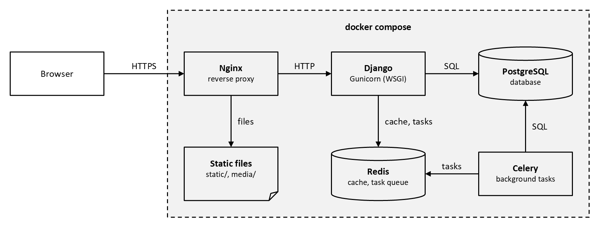

# System architecture

A system architecture diagram shows the parts of a system and what each
one talks to. This recipe draws a Django web system: Nginx in front,
Django under Gunicorn, PostgreSQL, Redis as the cache and task queue, and
a Celery worker, all running as docker compose services:



| Element | In pikslide |
|---|---|
| A service or program | `box "Django" bold "Gunicorn (WSGI)" small` |
| A database or queue | `cylinder "PostgreSQL" bold "database" small` |
| Files | `file "Static files" bold "static/, media/" small` |
| A call, from caller to callee | `arrow "SQL" above` |
| A boundary: a host, a network, a deployment | a `box` behind the parts, `fill bg1 darker 5% stroke dashed` |

## Source

[architecture.pik](architecture.pik):

```pikslide
# A Django web system: the parts that serve a request, and what each one
# talks to. The server side runs as docker compose services.

boxwid = 1.4in
boxht = 0.65in
cylwid = 1.4in
cylht = 0.8in
filewid = 1.4in
fileht = 0.8in

Browser: box "Browser"
arrow "HTTPS" above right 1.2in
Nginx: box "Nginx" bold "reverse proxy" small
arrow "HTTP" above right 0.8in
Django: box "Django" bold "Gunicorn (WSGI)" small
arrow "SQL" above right 0.8in
DB: cylinder "PostgreSQL" bold "database" small

row2 = Django.y - 1.5in
Static: file "Static files" bold "static/, media/" small at (Nginx.x, row2)
Redis: cylinder "Redis" bold "cache, task queue" small at (Django.x, row2)
Worker: box "Celery" bold "background tasks" small at (DB.x, row2)

arrow "files" ljust from Nginx.s to Static.n
arrow "cache, tasks" ljust from Django.s to Redis.n
arrow "tasks" above from Worker.w to Redis.e
arrow "SQL" ljust from Worker.n to DB.s

# The services' frame, drawn behind everything: wide enough for both
# rows, with room for its title at the top.
midx = (Nginx.w.x + DB.e.x) / 2
midy = (DB.n.y + Redis.s.y) / 2
Compose: box wid (DB.e.x - Nginx.w.x) + 0.5in ht (DB.n.y - Redis.s.y) + 0.8in \
    at (midx, midy + 0.15in) fill bg1 darker 5% stroke dashed behind Browser
"docker compose" bold at 0.25in below Compose.n
```

## How it's drawn

**Every part is one size.** `boxwid`, `cylwid`, `filewid` and their
heights are set once, at the top, so the parts line up on a grid. Each
part is its name in bold over its role in `small` text; keep the role
short enough to fit the width. The arrows inside the boundary are all
`0.8in`; the one from the browser is longer, to keep its label clear of
the boundary's edge.

**Arrows point from caller to callee**, labeled with what passes along
them: a protocol (`HTTPS`, `SQL`) or what it's used for (`cache, tasks`).

**The second row sits under the first.** Each part in it is placed `at
(X.x, row2)`, under the part that uses it, so the arrows between the rows
are straight, and Redis and Celery share a height, so the arrow between
them is too.

**The boundary is drawn last, behind everything.** Its size and center
come from the parts' edges (`wid (DB.e.x - Nginx.w.x) + 0.5in`), with
extra room at the top for its title, and its fill is a theme color, so it
follows a `--template`. `behind Browser` puts it under the very first
object, at the back: behind Nginx, it would hide the end of the HTTPS
arrow, drawn before Nginx. The center is computed into variables first
(`midx`, `midy`): a position can't start with `((`.

## Variations

- **Outside services**, such as a mail server or object storage, go
  outside the boundary, with an arrow crossing it.
- **Several hosts or networks**: one boundary box each, side by side or
  nested, each placed from the parts inside it.
