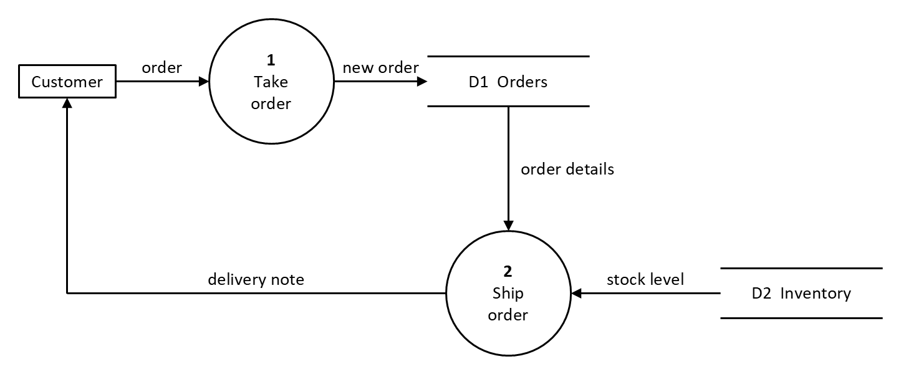

# Data flow diagrams (DFD)

A data flow diagram shows where data comes from, which processes
transform it, where it's kept, and where it goes. This recipe draws a
level-1 DFD in DeMarco/Yourdon notation:



| Element | Symbol | In pikslide |
|---|---|---|
| Process | circle, numbered | `circle "1" bold "Take" "order" rad 0.5in` |
| External entity | rectangle | `box "Customer" fit` |
| Data store | two parallel lines, named between them | a `store` macro: a block of two `line`s and a `text` |
| Data flow | arrow, labeled with the data it carries | `arrow "order" above` |

## Source

[dfd.pik](dfd.pik):

```pikslide
# Order handling, as a level-1 data flow diagram (DeMarco/Yourdon notation).

# A data store: two parallel lines with its name between them. The body
# starts on the `{` line: a labeled call, `Orders: store(...)`, needs the
# block right after the label.
define store { [
  Upper: line right 1.3in
  Lower: line right 1.3in from 0.4in below Upper.start
  text $1 at 1/2<Upper.c, Lower.c>
] }

Customer: box "Customer" fit
arrow "order" above right 150%
Take: circle "1" bold "Take" "order" rad 0.5in
arrow "new order" above right 150%
Orders: store("D1  Orders")

Ship: circle "2" bold "Ship" "order" rad 0.5in with .n at 1in below Orders.s
arrow "order details" ljust from Orders.s to Ship.n

Inventory: store("D2  Inventory") with .w at 1.2in right of Ship.e
arrow "stock level" above from Inventory.w to Ship.e

line "delivery note" above from Ship.w left until even with Customer
arrow up to Customer.s
```

## How it's drawn

**Processes.** A `circle` with the number in bold, then the name. Give
every process the same `rad` and break the name into lines yourself
(`"Take" "order"`): `fit` would size each circle to its own text, so
processes would come out in different sizes, and a name too wide for the
circle wraps where PowerPoint chooses, with a warning.

**Data stores.** No preset shape draws two parallel lines (see
[shapes.md](../shapes.md)), so `define store` makes one out of a block: two
`line`s and a `text` centered between them. A labeled call (`Orders:
store("D1  Orders")`) names the block like any other object, and its
edges are its bounding box's: `.w` and `.e` at the middle of its open
ends, `.n` and `.s` at the middle of each line. Start the macro body on
the `{` line: the body replaces the call as written, and a newline right
after `Orders:` is a syntax error.

**Data flows.** Label every flow with the data it carries, and keep the
label off the line: `above` on a horizontal arrow, `ljust` (to the right)
or `rjust` (to the left) on a vertical one. A string with no flag sits on
the line itself.

**Keep labeled flows straight.** A line's label is placed at the center
of the line's bounding box, and for a bent line that point is on neither
segment. So draw a bend as two pieces: a labeled `line` for the long
segment, then an `arrow` from where it ends:

```
line "delivery note" above from Ship.w left until even with Customer
arrow up to Customer.s
```

**Placement.** The top row chains left to right. The second process
hangs from the store it reads (`with .n at 1in below Orders.s`), and the
second store sits beside it (`with .w at 1.2in right of Ship.e`), so each
arrow between them is a straight line.

## Variations

- **Gane-Sarson notation** draws a process as a rounded rectangle (`box
  rad 0.1in`, or `shape roundRect`) and a data store as a rectangle open
  on its right; change the `store` macro's lines to draw that.
- **A context diagram** (level 0) is a single process with only external
  entities around it: the same pieces, without data stores.
