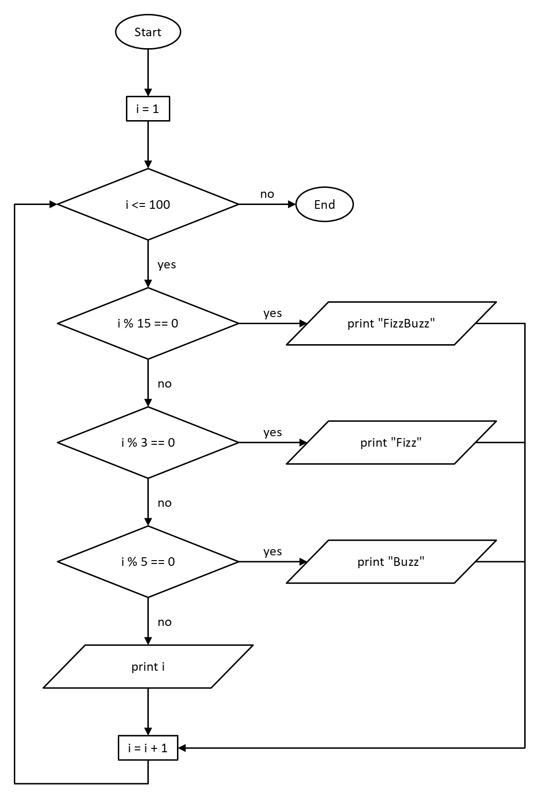

# Flowcharts

A flowchart follows a program step by step: what it does, where it
decides, and where it loops. This recipe draws FizzBuzz, which prints the
numbers 1 to 100 but Fizz for a multiple of 3, Buzz for a multiple of 5,
and FizzBuzz for both:



| Element | Symbol | In pikslide |
|---|---|---|
| Start, end | rounded ends | `oval "Start" fit` |
| Process | rectangle | `box "i = 1" fit` |
| Decision | diamond, a "yes" and a "no" leaving it | `diamond "i % 3 == 0" wid 1.9in ht 0.75in` |
| Input, output | parallelogram | `shape flowChartInputOutput "print i" wid 2.2in ht 0.45in` |
| Flow | arrow | `arrow`, `arrow "yes" above` |

## Source

[flowchart.pik](flowchart.pik):

```pikslide
# FizzBuzz, as a flowchart: for i from 1 to 100, print FizzBuzz for a
# multiple of 15, Fizz for one of 3, Buzz for one of 5, and i otherwise.

down
Start: oval "Start" fit
arrow
Init: box "i = 1" fit
arrow
Loop: diamond "i <= 100" wid 1.9in ht 0.75in
arrow "yes" ljust
By15: diamond "i % 15 == 0" same
arrow "no" ljust
By3: diamond "i % 3 == 0" same
arrow "no" ljust
By5: diamond "i % 5 == 0" same
arrow "no" ljust
PrintI: shape flowChartInputOutput "print i" wid 2.2in ht 0.45in
arrow
Next: box "i = i + 1" fit

End: oval "End" fit with .w at 0.6in right of Loop.e
arrow "no" above from Loop.e to End.w

# Each "yes" goes right, to its own output. An output's slanted sides
# start a fifth of its width in, so the middle of each is a tenth in from
# the box that .w and .e belong to: lines end there, on the outline.
Fizzbuzz: shape flowChartInputOutput "print \"FizzBuzz\"" same as PrintI with .w at 0.5in right of By15.e
Fizz: shape flowChartInputOutput "print \"Fizz\"" same as PrintI with .w at 0.5in right of By3.e
Buzz: shape flowChartInputOutput "print \"Buzz\"" same as PrintI with .w at 0.5in right of By5.e
inset = PrintI.wid / 10
arrow "yes" above from By15.e to Fizzbuzz.w + (inset, 0)
arrow "yes" above from By3.e to Fizz.w + (inset, 0)
arrow "yes" above from By5.e to Buzz.w + (inset, 0)

# The three outputs join one line down the right, into i = i + 1.
busx = Fizzbuzz.e.x + 0.3in
line from Fizzbuzz.e - (inset, 0) to (busx, Fizzbuzz.y) then to (busx, Next.y)
line from Fizz.e - (inset, 0) to (busx, Fizz.y)
line from Buzz.e - (inset, 0) to (busx, Buzz.y)
arrow from (busx, Next.y) to Next.e

# And back round the left, to the loop test.
leftx = PrintI.w.x - 0.3in
arrow from Next.s down 0.25in then to (leftx, Next.s.y - 0.25in) then to (leftx, Loop.y) then to Loop.w
```

## How it's drawn

**The main path runs straight down.** After `down`, each `arrow` and each
shape goes below the one before it, so the path needs no coordinates.
The branches and the loop are drawn afterwards, from the shapes' edges.

**Decisions are all one size.** The first diamond has a fixed `wid` and
`ht`, and the others copy it with `same`. Give it room: PowerPoint sets a
diamond's text in the middle half of its width, so it has to be a bit
over twice as wide as its widest line (plus `margin` on each side).

**Inputs and outputs are a preset shape**, `flowChartInputOutput` (see
[shapes.md](../shapes.md)), with a fixed size copied by `same as PrintI`.
Don't `fit` one: `fit` sizes a preset shape as if it were a box, and
the text ends up running into the slanted sides.

**Lines meet the slanted sides.** A preset shape's edges (`.w`, `.e`) and
`chop` belong to its bounding box, which sits outside a slanted side.
This shape's slanted sides start a fifth of its width in, so the middle
of each is a tenth in: `Fizzbuzz.w + (inset, 0)` with `inset =
PrintI.wid / 10` is on the outline itself.

**Label each exit of a decision**: `above` an arrow going right, `ljust`
beside one going down.

**Branches join on one line.** Each output runs a `line`, with no head, to
a shared vertical line on the right, and a single `arrow` takes it into
`i = i + 1`. The loop goes back round the left with `then to` points.
The coordinates they pass through are variables (`busx`, `leftx`)
computed from the shapes, so the lines move with them.

## Variations

- **A `while` loop with the test at the bottom** is the same pieces: the
  loop-back arrow leaves the last decision instead of the last process.
- **Swimlanes**: draw a tall `box` per actor, `behind` the first shape,
  and place each step in its lane with `at (Lane.x, ...)`.
