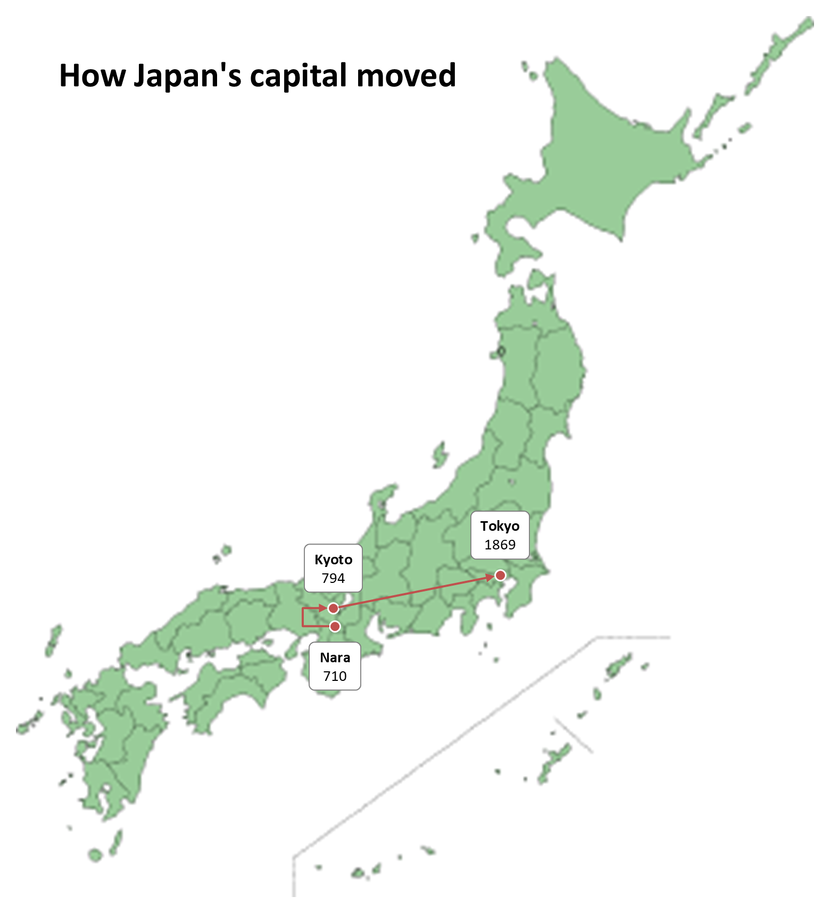

# How Japan's capital moved

[japan-capitals.pik](japan-capitals.pik) was drawn by Claude Code: the
prompt below, given as it is to a new Claude Code session at the
repository's root, in one run. That run rendered it to
[japan-capitals.pptx](japan-capitals.pptx) and the PNG below.



## The prompt

```text
Draw a slide with pikslide on how Japan's capital moved.

1. Download the map of Japan at
   https://commons.wikimedia.org/wiki/File:%E6%97%A5%E6%9C%AC%E5%9C%B0%E5%9B%B3.png
   and place it on the slide.
2. Put a pin, a circle, on Nara, Kyoto and Tokyo.
3. Join them with arrows, Nara -> Kyoto -> Tokyo, and label each city
   with the year it became the capital. For Kyoto, go by the imperial
   edict moving the capital to Heian-kyo; for Tokyo, by the Emperor's
   move there.

Save the map and the diagram in docs/examples/, the diagram as
japan-capitals.pik, and render it with
`uv run pikslide docs/examples/japan-capitals.pik docs/examples/japan-capitals.pptx --png`.

Start with `uv run pikslide --help intro`, and use `--help KEYWORD` for
anything else you need. Look at the PNG yourself before you finish: a pin
off its city, text that overlaps or overflows, arrows that miss the pins.
Fix them and render again.
```

## The map

[japan-map.png](japan-map.png) is
[File:日本地図.png](https://commons.wikimedia.org/wiki/File:%E6%97%A5%E6%9C%AC%E5%9C%B0%E5%9B%B3.png)
from Wikimedia Commons, in the public domain.
