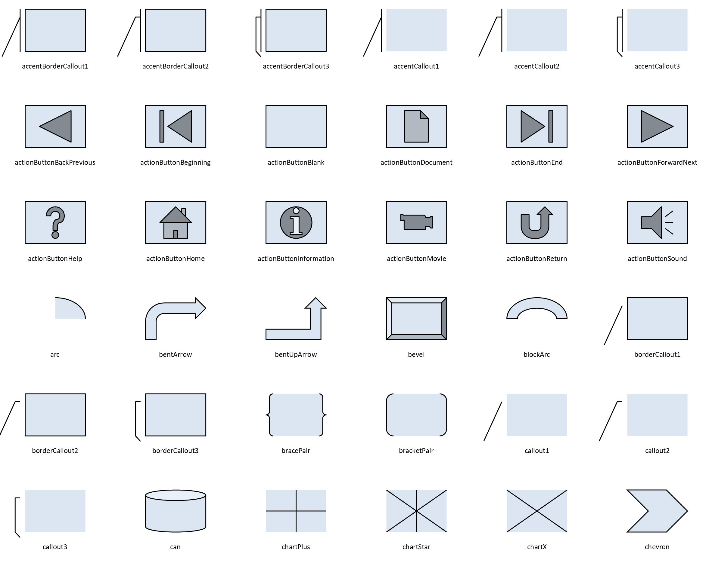
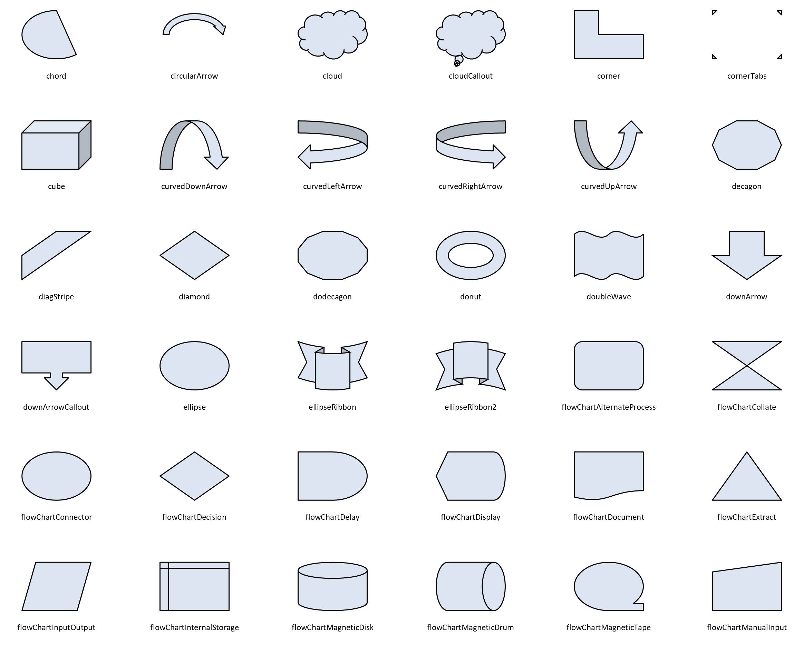
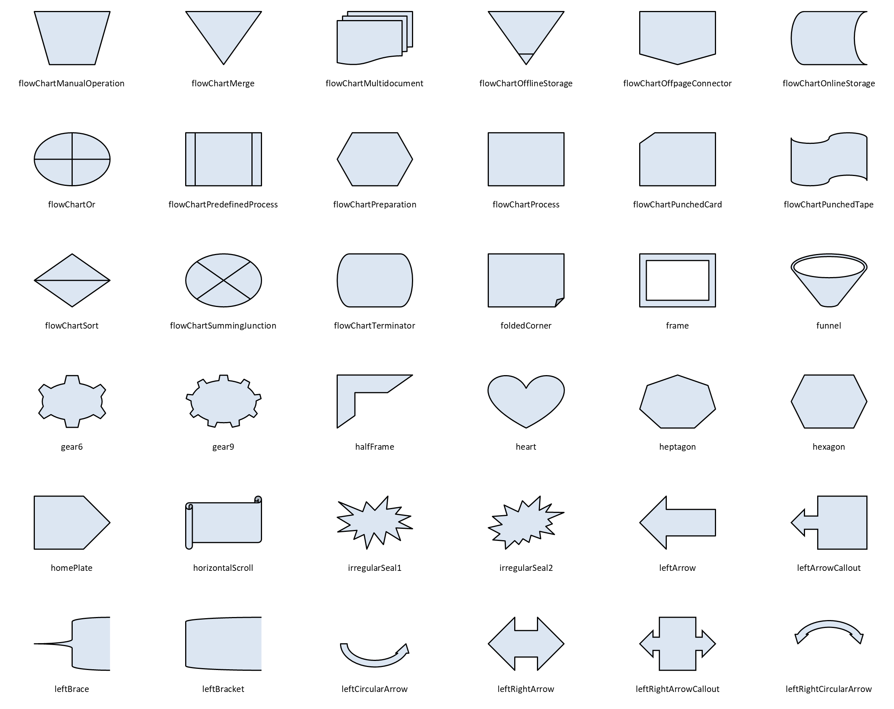
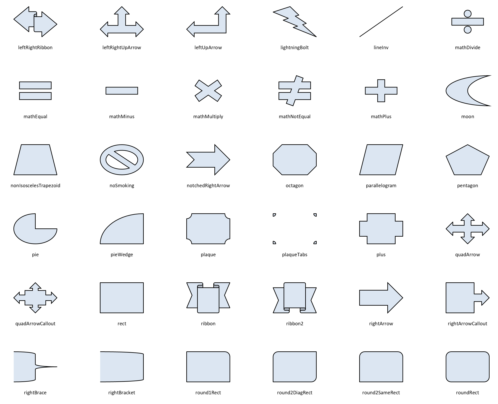
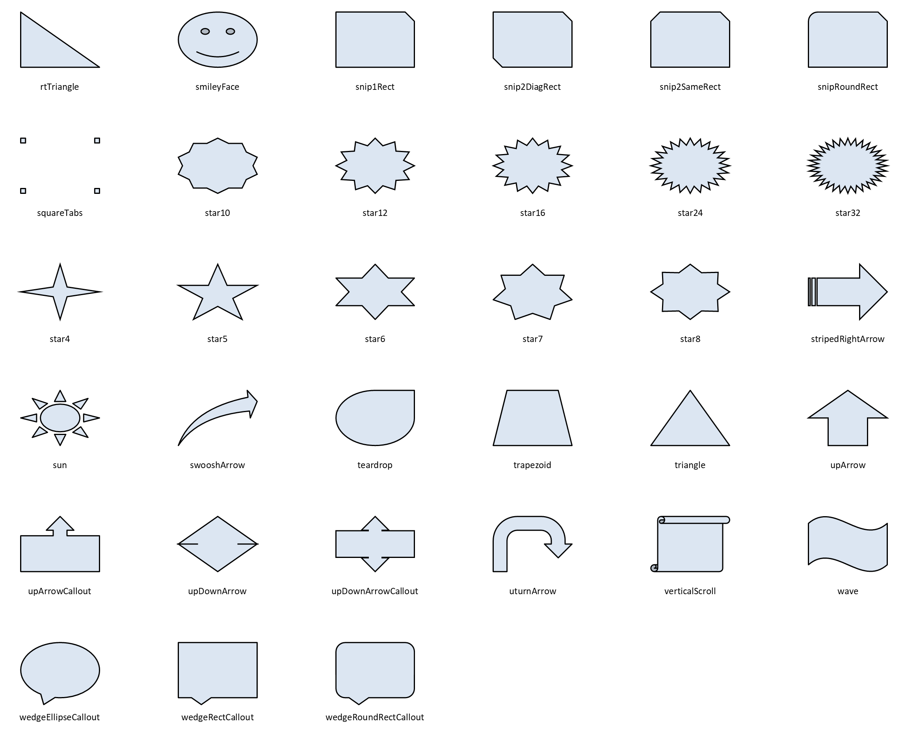

# Preset shapes

<!-- Written by scripts/gen_shape_gallery.py: don't edit. -->

All 177 preset shapes that `shape NAME` draws, each as PowerPoint
renders it at its default geometry in a 1 in × 0.7 in box.
`pikslide --help shapes` says in words what each one looks like.

They're filled here (`fill accent1 lighter 80%`) to show their area. With
pikslide's default, no fill, a shape with no outline, such as
`callout1`, shows only its leader line.

## accentBorderCallout1 … chevron

`accentBorderCallout1`, `accentBorderCallout2`, `accentBorderCallout3`, `accentCallout1`, `accentCallout2`, `accentCallout3`, `actionButtonBackPrevious`, `actionButtonBeginning`, `actionButtonBlank`, `actionButtonDocument`, `actionButtonEnd`, `actionButtonForwardNext`, `actionButtonHelp`, `actionButtonHome`, `actionButtonInformation`, `actionButtonMovie`, `actionButtonReturn`, `actionButtonSound`, `arc`, `bentArrow`, `bentUpArrow`, `bevel`, `blockArc`, `borderCallout1`, `borderCallout2`, `borderCallout3`, `bracePair`, `bracketPair`, `callout1`, `callout2`, `callout3`, `can`, `chartPlus`, `chartStar`, `chartX`, `chevron`

## chord … flowChartManualInput

`chord`, `circularArrow`, `cloud`, `cloudCallout`, `corner`, `cornerTabs`, `cube`, `curvedDownArrow`, `curvedLeftArrow`, `curvedRightArrow`, `curvedUpArrow`, `decagon`, `diagStripe`, `diamond`, `dodecagon`, `donut`, `doubleWave`, `downArrow`, `downArrowCallout`, `ellipse`, `ellipseRibbon`, `ellipseRibbon2`, `flowChartAlternateProcess`, `flowChartCollate`, `flowChartConnector`, `flowChartDecision`, `flowChartDelay`, `flowChartDisplay`, `flowChartDocument`, `flowChartExtract`, `flowChartInputOutput`, `flowChartInternalStorage`, `flowChartMagneticDisk`, `flowChartMagneticDrum`, `flowChartMagneticTape`, `flowChartManualInput`

## flowChartManualOperation … leftRightCircularArrow

`flowChartManualOperation`, `flowChartMerge`, `flowChartMultidocument`, `flowChartOfflineStorage`, `flowChartOffpageConnector`, `flowChartOnlineStorage`, `flowChartOr`, `flowChartPredefinedProcess`, `flowChartPreparation`, `flowChartProcess`, `flowChartPunchedCard`, `flowChartPunchedTape`, `flowChartSort`, `flowChartSummingJunction`, `flowChartTerminator`, `foldedCorner`, `frame`, `funnel`, `gear6`, `gear9`, `halfFrame`, `heart`, `heptagon`, `hexagon`, `homePlate`, `horizontalScroll`, `irregularSeal1`, `irregularSeal2`, `leftArrow`, `leftArrowCallout`, `leftBrace`, `leftBracket`, `leftCircularArrow`, `leftRightArrow`, `leftRightArrowCallout`, `leftRightCircularArrow`

## leftRightRibbon … roundRect

`leftRightRibbon`, `leftRightUpArrow`, `leftUpArrow`, `lightningBolt`, `lineInv`, `mathDivide`, `mathEqual`, `mathMinus`, `mathMultiply`, `mathNotEqual`, `mathPlus`, `moon`, `nonIsoscelesTrapezoid`, `noSmoking`, `notchedRightArrow`, `octagon`, `parallelogram`, `pentagon`, `pie`, `pieWedge`, `plaque`, `plaqueTabs`, `plus`, `quadArrow`, `quadArrowCallout`, `rect`, `ribbon`, `ribbon2`, `rightArrow`, `rightArrowCallout`, `rightBrace`, `rightBracket`, `round1Rect`, `round2DiagRect`, `round2SameRect`, `roundRect`

## rtTriangle … wedgeRoundRectCallout

`rtTriangle`, `smileyFace`, `snip1Rect`, `snip2DiagRect`, `snip2SameRect`, `snipRoundRect`, `squareTabs`, `star10`, `star12`, `star16`, `star24`, `star32`, `star4`, `star5`, `star6`, `star7`, `star8`, `stripedRightArrow`, `sun`, `swooshArrow`, `teardrop`, `trapezoid`, `triangle`, `upArrow`, `upArrowCallout`, `upDownArrow`, `upDownArrowCallout`, `uturnArrow`, `verticalScroll`, `wave`, `wedgeEllipseCallout`, `wedgeRectCallout`, `wedgeRoundRectCallout`
